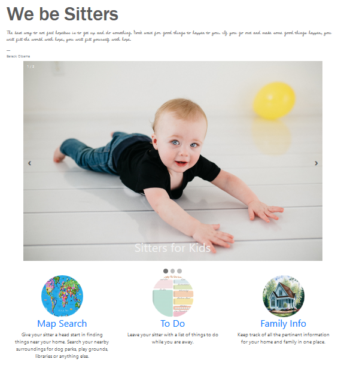
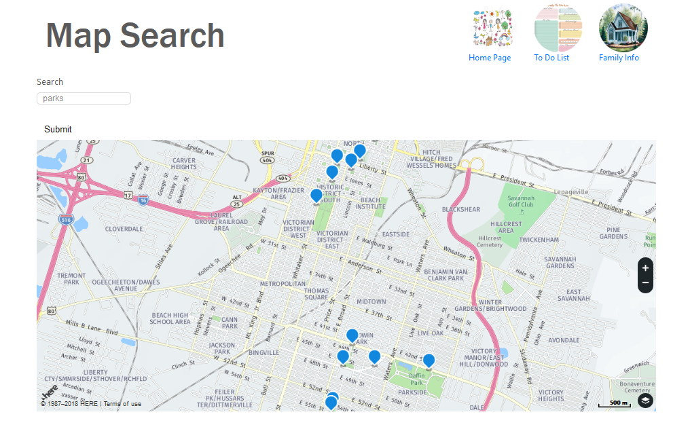
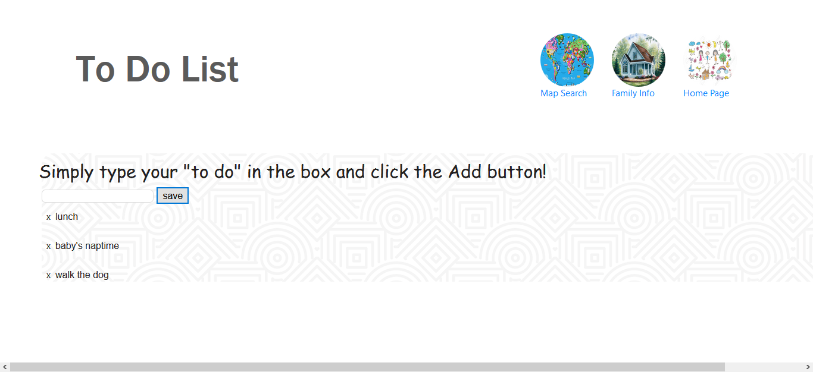
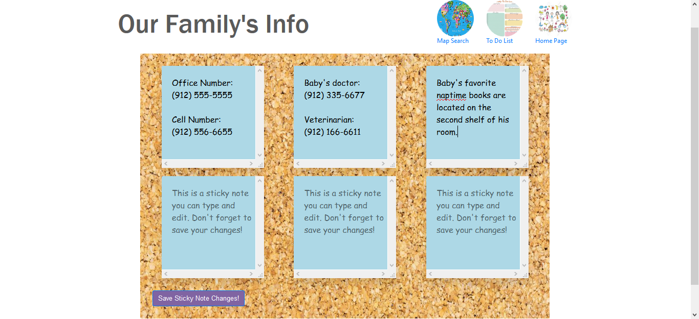

# We Be Sitters

An application which assists with communications between people and those whom they charge with taking care of their babies, homes, and/or pets while they are away. It allows the user to keep track of all the pertinent information for their home and family, leave the sitter with a to-do list, and allow everyone to search nearby surroundings for parks, playgrounds, libraries, or other locations for relevant needs.

## How to Use

User opens the application via the GitHub Pages [link](https://wespres1990.github.io/We-Be-Sitters/)

Upon loading, the home page consists of several elements. At the top are inspirational quotes generated by a quote API once a day, which was added for a unique and lighthearted touch and to keep the website geared with kids in mind with a fun appeal. Below it is a carousel (from W3Schools) which displays one of three images at a time, and those images accompany the services offered by the site - sitters for babies, sitters for houses, and sitters for pets. When the user clicks on the arrows on either side of the carousel, the images change along with their accompanying services. Along the bottom are the three buttons which direct the user to the parts of the site which allow the user to access a range of useful applications: the Map Search, To-Do List, and Family Information page. 

The map page consists of an API from here.com which renders a map on the page and allows for functionality on the map, so that the user is able to move to, as well as zoom in and out of, different locations. It also allows the user to switch map types, so that they can view satellite imagery, terrain, and an ordinary map. Additionally and crucially for this project, it allows the user to search for places which are relevant to him or her, such as a park/playground for taking out babies and pets. 

Unfortunately, the points on the map do not tell the user what is in the location, unless it is already on the map such as Forsyth Park, Oglethorpe Mall, and Savannah-Hilton Head International Airport.

This API also required some fixes/work-arounds to achieve the functionality we desired, and even after that, the map can only be displayed from a downloaded repository and does not display on GitHub pages, because the API uses http, while GitHub Pages uses https and only paid accounts on GitHub can overcome this limitation.

On the To-Do List page, the user is able to make a list of things that need to be done. For example, a this may be used by a parent communicating with the a baby sitter to inform them of what the baby needs while the parent is away. When a task is added, it is added to the “To Do” section of the To-Do List. When a task was completed and checked, the task would be moved to the “Completed” section, and if deleted, it would be removed completely.

Although merging the list was successful, this list posed an issue when it came time to try to add local storage. With the time crunch and complexity, we decided to push this list aside and use a previous activity to ensure we had a local storage that would operate functionally. In the future, it would be preferred to have this To-Do list functioning with local storage.

On the Family Information Page, we have have some text inputs and scroll bars, with local storage so families can add their info and save it for future sitters, such as alarm code information, emergency numbers, doctor or
veterinarian information, as well as possible allergies or favorite recipes. As with the aforementiond To-Do List, an issue that came up was the process adding the local storage, and an alternative method was necessary to make this functional.

At the top right of the Map, To-Do List, and Family Info pages are buttons which allow the user to access the other pages of the site.

### Technologies Used

Languages - HTML5, CSS4, JavaScript

Libraries - Bootstrap, jQuery

Other tools, technologies, and techniques - AJAX, here.com Map API, Quotes API 

Text Editor - Visual Studio Code

## Preview

### Main Page
- - - -

### Map Search for Parks
- - - -

### To-Do List with Three Items
- - - -

### Family Information
- - - -

## Contributing

Please feel free to branch off with tweaks and making a repo; open to suggestions for improvement!

## Future Development

* Additional styling.

* Making the map render onto the page as a functional part of the site, perhaps with a different API if necessary.

* Have the To-Do List and Family Info pages functioning with local storage.

* Making the sticky notes mobile and customizable, with the ability for the user to add and delete sticky notes at their desire. 

* Having a functional calendar via an API so families can book their sitters, see upcoming events, and sitters can make plans, see alerts, among other things.

## Authors

* **Wesley Hutchins** - [Github](https://github.com/WesPres1990)
* **Kat Harris** - [Github](https://github.com/katophelix)
* **Cynthia Sidlauskas** - [Github](https://github.com/cynthiasidlauskas)